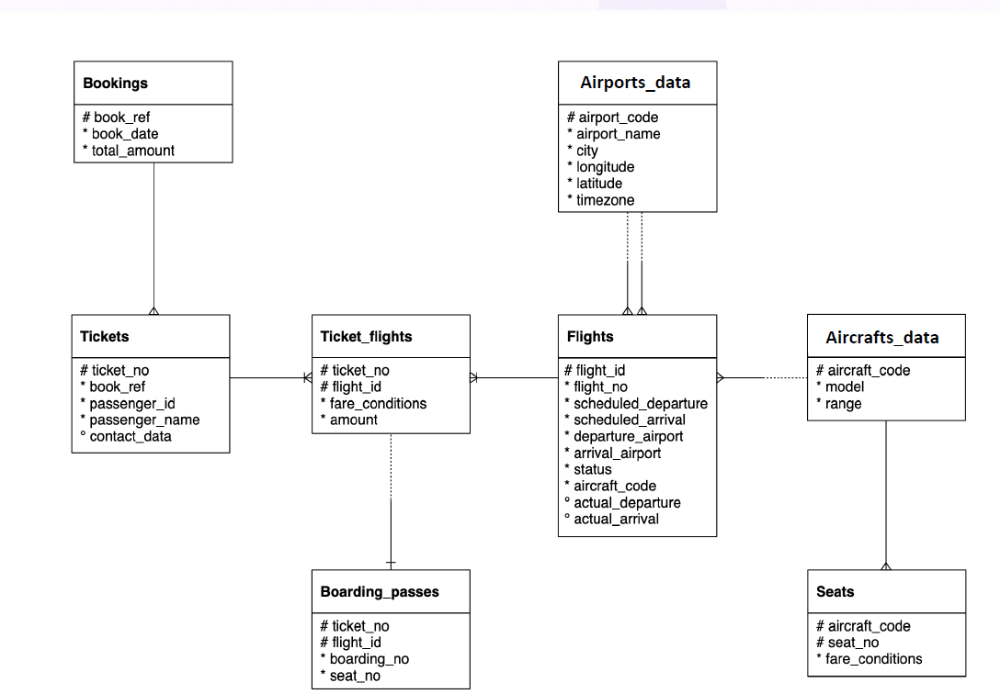

# AirlineDB SQL Case Studies

## Project Overview

This project showcases SQL-based analysis on an Airline Reservation Database. The objective is to solve real-world business problems using SQL and derive meaningful insights from airline operations, passenger behavior, booking trends, and revenue generation.

The project consists of 10 SQL case studies covering fundamental and advanced SQL concepts including Joins, Aggregations, Window Functions, Date Functions, CTEs, and Subqueries.

---

## Database Schema

The AirlineDB database contains the following tables:

* Bookings
* Tickets
* Ticket_Flights
* Boarding_Passes
* Flights
* Airports_Data
* Aircrafts_Data
* Seats

### Entity Relationship (ER) Diagram




---

## SQL Case Studies

| No. | Case Study                           | SQL Concepts                     |
| --- | ------------------------------------ | -------------------------------- |
| 01  | Tickets Without Boarding Passes      | LEFT JOIN, COUNT, NULL Handling  |
| 02  | Booking Date Formatting              | Date Functions, Formatting       |
| 03  | Airport Traffic Ranking              | JOIN, GROUP BY, COUNT, RANK      |
| 04  | Top Frequent Flyers                  | GROUP BY, COUNT, ORDER BY, LIMIT |
| 05  | Flights with Highest Passenger Count | GROUP BY, COUNT, ORDER BY        |
| 06  | Average Ticket Price by Class        | AVG, ROUND, GROUP BY             |
| 07  | Top Revenue Routes                   | JOIN, SUM, GROUP BY              |
| 08  | Monthly Booking Trend Analysis       | DATE_TRUNC, COUNT, GROUP BY      |
| 09  | Top Passengers by Spending           | CTE, JOIN, SUM                   |
| 10  | Flights Above Average Revenue        | Subquery, HAVING, Aggregation    |

---

## Repository Structure

```text
AirlineDB-SQL-Case-Studies
│
├── README.md
│
├── images
│   └── ER_Diagram.png
│
└── sql_queries
    ├── 01_Tickets_Without_Boarding_Pass.sql
    ├── 02_booking_date_formatting.sql
    ├── 03_Airport_Traffic_Ranking.sql
    ├── 04_Top_Frequent_Flyers.sql
    ├── 05_Highest_Passenger_Flights.sql
    ├── 06_Average_Ticket_Price_By_Class.sql
    ├── 07_Top_Revenue_Routes.sql
    ├── 08_Monthly_Booking_Trend.sql
    ├── 09_Top_Passengers_By_Spending.sql
    └── 10_Flights_Above_Average_Revenue.sql
```

---

## Skills Demonstrated

### SQL Fundamentals

* SELECT
* WHERE
* ORDER BY
* GROUP BY
* HAVING

### Joins

* INNER JOIN
* LEFT JOIN

### Aggregate Functions

* COUNT()
* SUM()
* AVG()
* ROUND()

### Window Functions

* RANK()

### Advanced SQL

* Common Table Expressions (CTEs)
* Subqueries

### Date Functions

* TO_CHAR()
* DATE_TRUNC()

---

## Tools Used

* PostgreSQL
* SQL
* GitHub

---

## Learning Outcomes

Through this project, I practiced:

* Writing optimized SQL queries
* Working with relational databases
* Solving business-oriented analytical problems
* Performing passenger and flight analysis
* Revenue analysis and trend reporting
* Applying window functions for ranking
* Using CTEs and subqueries for advanced querying

---

## Future Enhancements

* Add more advanced SQL case studies
* Implement additional window functions
* Create Power BI dashboards using the same dataset
* Perform end-to-end airline business analytics
* Add query output screenshots and visualizations

---

## Author

**Souvik Sen**


